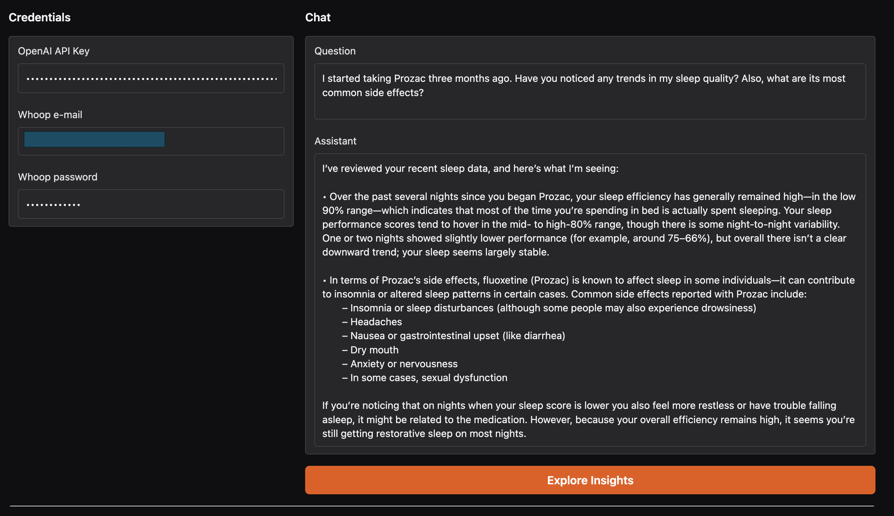

 

# WellBe+ Assistant 

WellBe+ AI Agent is a multi-context assistant built with the agents SDK framework from OpenAI. It orchestrates three secure MCP servers: a public drug-knowledge FDA service, a WHOOP biometric feed, and a MySQL clinical data store. Every user question is answered with up-to-date medication data. For example, the agent can answer to more generic questions such as “What are the adverse effects of Prozac?” or more specific ones including complex queries where both FDA and Whoop data can be combined: "I started to take Prozac 3 months ago, do you see any trends in my sleep quality and what are its most frequent side-effects?" The same architecture scales to workout recovery tips, drug interaction cross-checks, or longitudinal trend insights.

 

## MCP Servers in use

[Whoop](https://smithery.ai/server/@ctvidic/whoop-mcp-server)

[Healthcare MCP with PubMed, FDA and other APIs](https://smithery.ai/server/@Cicatriiz/healthcare-mcp-public)

[MySQL + custom drug interaction](https://smithery.ai/server/mysql-mcp-server)

## How to start the application

If you plan to use our custom database:

- **Install Docker**: Follow the official guide → [Docker Engine installation](https://docs.docker.com/engine/install/) 
- **Install Docker Compose**: Follow the plugin guide → [Docker Compose installation](https://docs.docker.com/compose/install/) 
- Run `docker-compose up` in the project directory (make sure data/ folder is not empty)
- Add credentials

---
title: WellBe+ Assistant 
sdk: gradio
sdk_version: 5.33.0
app_file: app.py
pinned: true
tags:
- agent-demo-track
---

Try it on [HuggingFace Spaces](https://huggingface.co/spaces/natasha1704/WellBePlusAssistant)